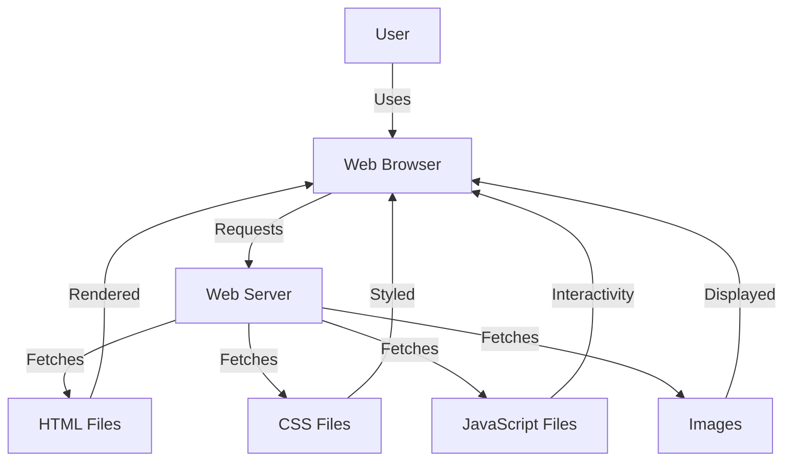

```mermaid
  graph TD;
      A[User] -->|Uses| B[Web Browser];
      B -->|Requests| C[Web Server];
      C -->|Fetches| D[HTML Files];
      C -->|Fetches| E[CSS Files];
      C -->|Fetches| F[JavaScript Files];
      C -->|Fetches| G[Images];
      G -->|Displayed| B;
      D -->|Rendered| B;
      E -->|Styled| B;
      F -->|Interactivity| B;
```